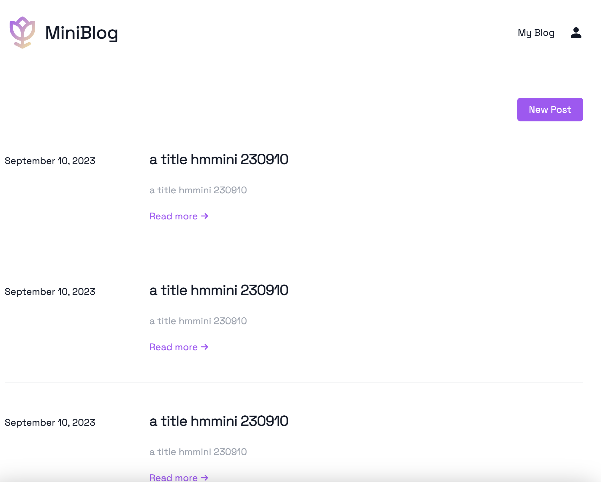
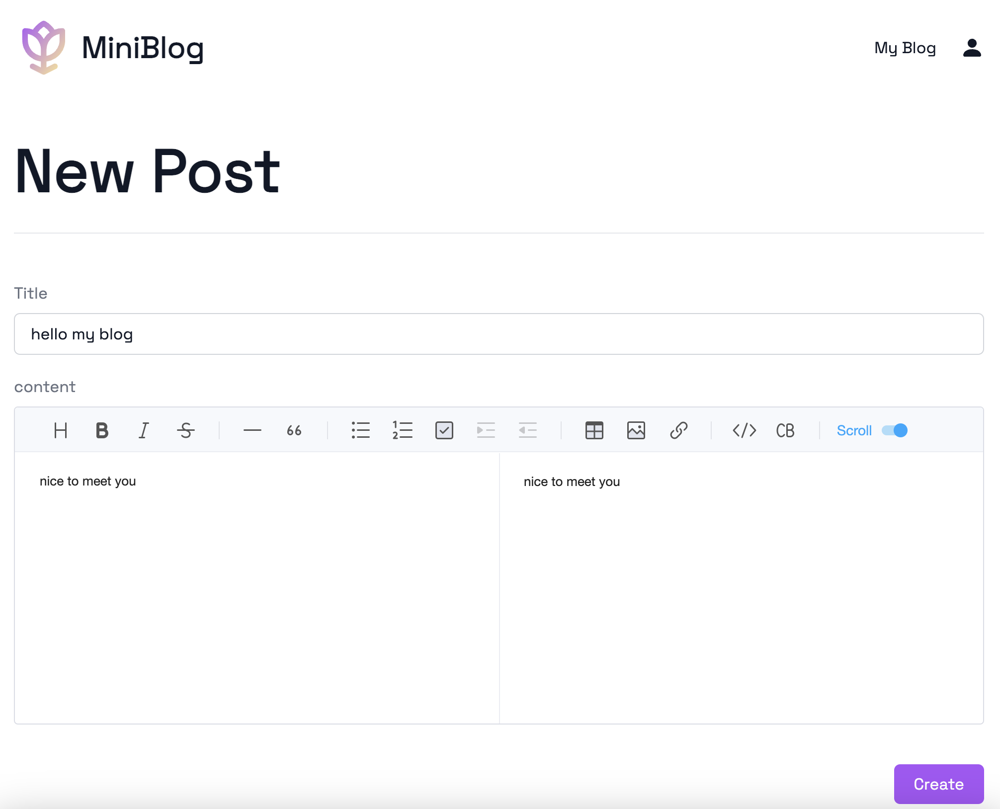
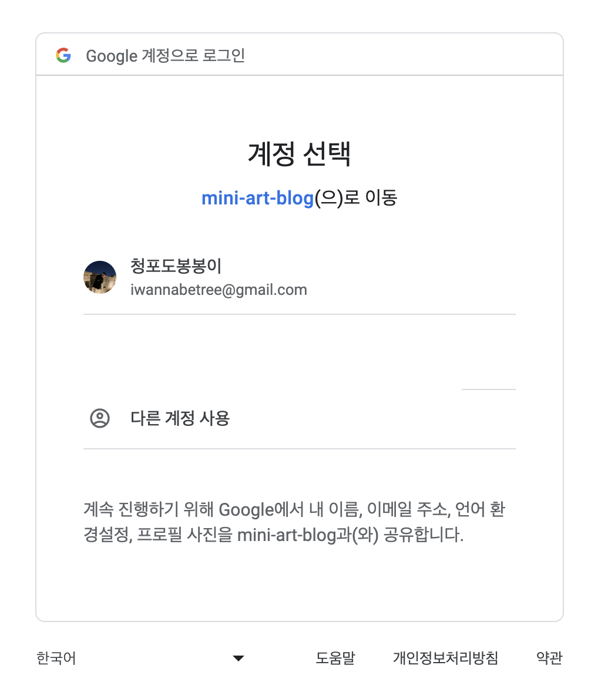
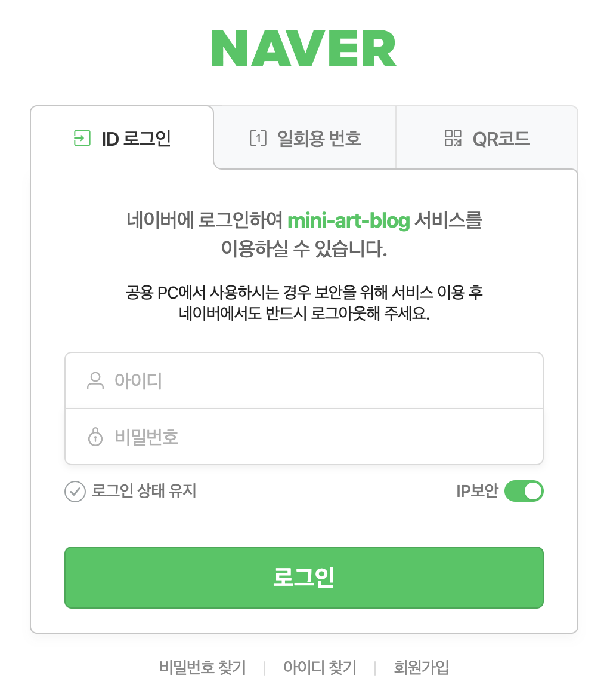
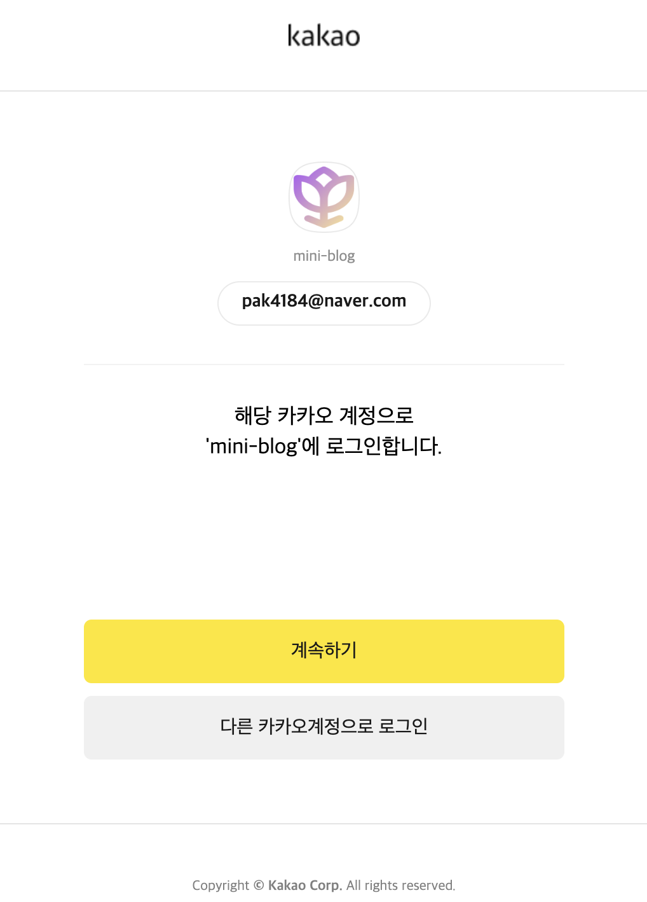
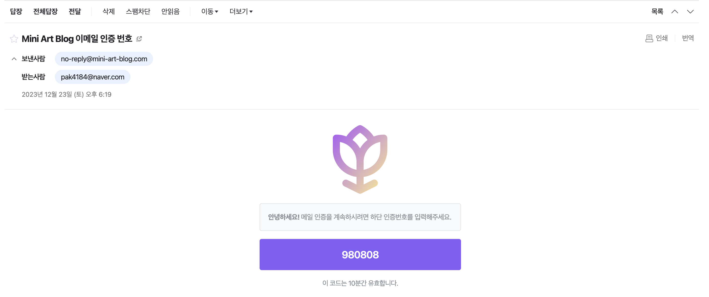
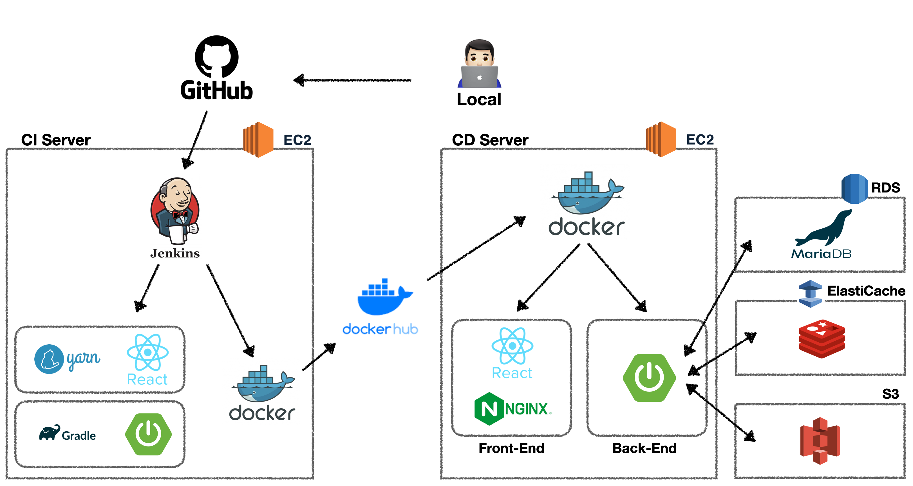

    <a href="http://www.mini-art-blog.com/" target="_blank">
        
        <h5>www.mini-art-blog.com</h5>
    </a>

---

    
    
     
    
    
    
     
    
    <h3><a href="http://www.mini-art-blog.com/">Try to Mini Blog 😁</a></h3>

 

## Meaning

---

백엔드, 프론트 최신 기술스택에 미숙한 둘이서 실력 향상을 위한 가장 기본적인 서비스인 블로그를 구현해보는 프로젝트

 

## PurPose

---

- SpringBoot와 JPA를 통해 기본적인 CRUD를 직접 익히면서 가장 기본인 블로그를 구현
- Spring의 동작 원리 및 SpringBoot와의 차이점 이해하기
- Spring Data JPA, QueryDsl 등 ORM에 대해 이해하기
- Rest API로 CRUD 구현
- Spring Security, Jwt 토큰와 Redis를 이용한 로그인 관리 및 쿠키, 세션과의 차이점 이해하기
- oAuth2를 이용한 로그인 구현
- 회원가입 인증메일 발송 로직 구현
- CustomeException을 만들어 로그의 가독성 향상 시키기
- GitHub, Jenkins, Docker를 이용한 무중단 CI/CD 파이프라인 구축해보기
- Git의 branch를 이슈별로 관리하여 Commit, Pull Request 협업 시뮬레이션
- AWS 클라우드 서비스를 이용한 서버 구성 경험해보기

 

## Architectrue

---

    

 

## Skills

---

### - BackEnd

- Java11, SpringBoot 2.7.9, Spring Data JPA, Spring Security, JUnit5, JWT, oAuth2, Swagger UI, Jasypt
- Jenkins, Gradle, Docker, AWS EC2, AWS RDS, AWS ElastiCache, AWS S3, AWS SES, AWS Route 53,
- H2, MariaDB, Redis

### - FrontEnd

- React, Vite, TypeScript, JavaScript, Axios, TailwindCss, CustomHook
- React-router, React-query, Redux-toolkit, Redux-persist, Toast-ui
- Yarn, Jenkins, Docker, AWS EC2, AWS RDS
- Nginx
- Eslint, Prettier

 

## Members

---

    <table style="text-align: center">
        <thead style="margin: 10px">
            <td>BackEnd</td>
            <td>FrontEnd</td>
        </thead>
        <tbody>
            <td><a href="https://github.com/pak0426">hmmini</a></td>
            <td><a href="https://github.com/art11010">art</a></td>
        </tbody>
    </table>

