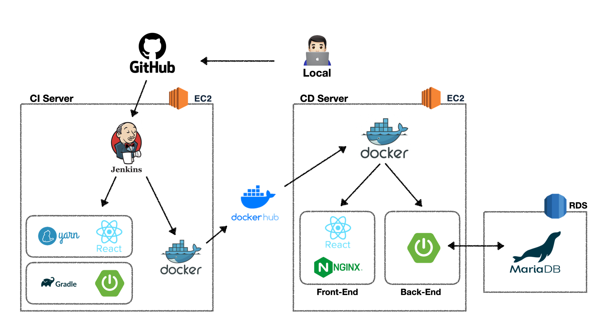

    

---

    
    
    <h1><a href="http://54.180.91.118:8080/">Mini Blog</a></h1>

## Meaning

---

백엔드, 프론트 최신 기술스택에 미숙한 둘이서 실력 향상을 위한 가장 기본적인 CRUD인 블로그를 구현해보는 프로젝트

## PurPose

---

- Spring의 동작 원리 및 SpringBoot와의 차이점 이해하기
- Spring Data JPA, QueryDsl 등 ORM에 대해 이해하기
- Rest API로 CRUD 구현
- Spring Security와 Jwt 토큰을 사용한 로그인 관리 및 쿠키, 세션과의 차이점 이해하기
- CustomeException을 만들어 로그의 가독성 향상 시키기
- GitHub, Jenkins, Docker를 이용한 무중단 CI/CD 파이프라인 구축해보기
- Git의 branch를 이슈별로 관리하여 Commit, Pull Request 협업 시뮬레이션

## Architectrue

---

    

## Skills

### - BackEnd

---

- Java11, SpringBoot2.7.9, Spring Data JPA, Spring Security, JUnit5, JWT, Swagger UI, Jasypt
- Jenkins, Gradle, Docker, AWS EC2, AWS RDS
- H2, MariaDB

### - FrontEnd

---

- react, typescript, javascript, redux, axios, toast-ui, tailwindcss, eslint, prettier
- Jenkins, yarn, Docker, AWS EC2, AWS RDS
- nginx

## Members

---

    <table style="text-align: center">
        <thead style="margin: 10px">
            <td>BackEnd</td>
            <td>FrontEnd</td>
        </thead>
        <tbody>
            <td><a href="https://github.com/pak0426">hmmini</a></td>
            <td><a href="https://github.com/art11010">art</a></td>
        </tbody>
    </table>

